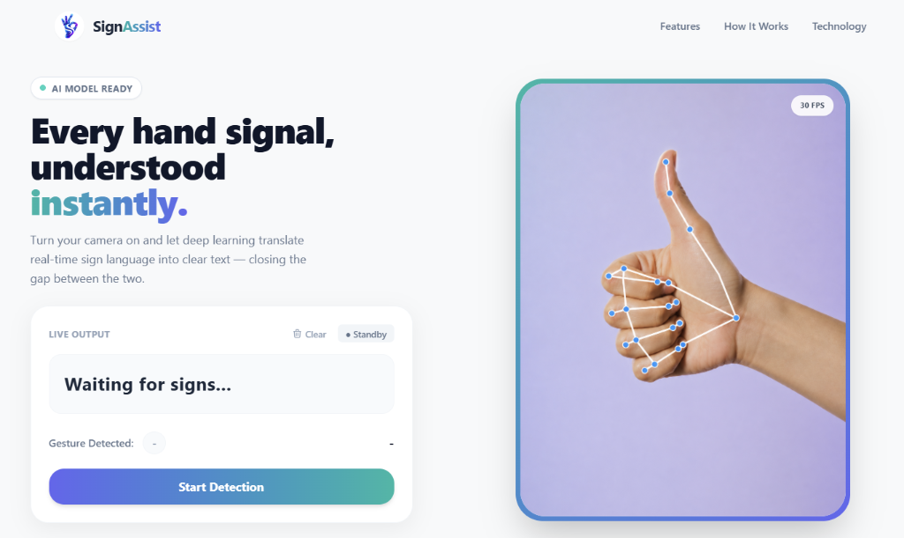

#  SignAssist: Real-Time Sign Language Translator

[](https://arpanchaudhari.github.io/SignAssist/)
[]()
[]()

SignAssist is a client-side web application that uses Deep Learning and Computer Vision to translate sign language alphabets into text in real-time. Built with PyTorch, MediaPipe, and ONNX Runtime Web, the AI inference happens **entirely in your browser**—ensuring absolute privacy and zero server latency.

<div align="center">
  
</div>
<br>

**[👉 Try the Live Demo Here](https://arpanchaudhari.github.io/SignAssist/)**

---

## ✨ Features
- **Full Sign Language Dictionary:** Accurately detects all alphabets (A-Z), numbers (0-9), and functional commands (`SPACE`, `DELETE`) in real-time.
- **Word & Sentence Builder:** Intelligently combines characters into words. Use the custom Space and Delete gestures to type fluidly without touching a keyboard.
- **100% Client-Side Inference:** Powered by ONNX Runtime Web, meaning your webcam video is never sent to a server. Privacy is guaranteed.
- **Ultra-Low Latency:** Achieves smooth 30+ FPS inference directly in the browser using WebGL/WASM acceleration.
- **Modern UI/UX:** Fully responsive, premium interface built with Tailwind CSS, custom SVGs, and Google Fonts.

## 🛠️ Technology Stack
**Machine Learning / AI:**
* **PyTorch:** Used to train the underlying Deep Neural Network on hand-landmark coordinates.
* **MediaPipe:** Extracts 21 3D hand landmarks from the webcam feed in real-time.
* **ONNX:** The PyTorch model was exported to ONNX format for highly optimized edge-inference.

**Frontend Web:**
* **ONNX Runtime Web:** Executes the AI model inside the browser.
* **JavaScript (Vanilla):** Handles webcam streaming, gesture debouncing, and UI state logic.
* **Tailwind CSS:** Powers the beautiful, responsive, gradient-rich user interface.

## 🧠 How It Works
1. **Data Extraction:** Google's MediaPipe scans the webcam feed and extracts the X, Y, and Z coordinates of 21 key points on the user's hand.
2. **Preprocessing:** The coordinates are normalized relative to the wrist to ensure the model works accurately regardless of how close or far the hand is from the camera.
3. **Inference:** The 63 data points (21 points × 3 axes) are fed into the lightweight ONNX neural network.
4. **Translation:** The model outputs confidence scores for each alphabet. The UI instantly updates the "Live Output" sentence builder based on a frame-persistence algorithm to prevent flickering.

## 🚀 Running Locally
Because the model runs entirely on the client side, running this project locally requires zero Python backend setup!

```bash
# 1. Clone the repository
git clone https://github.com/arpanchaudhari/SignAssist.git
cd SignAssist

# 2. Start a simple local server (to bypass browser security policies)
python -m http.server 8000
```
*Then open `http://localhost:8000` in your web browser.*

## 📂 Repository Structure
* `/src/` - Python scripts for dataset collection, model training, and ONNX exporting.
* `/models/` - PyTorch (`.pth`) and ONNX (`.onnx`) model weights.
* `/data/` - CSV files containing the hand-landmark training data.
* `index.html` - The main web interface.
* `/js/script.js` - Core logic for MediaPipe and ONNX Web inference.
* `/css/style.css` - Custom styling and animations.
